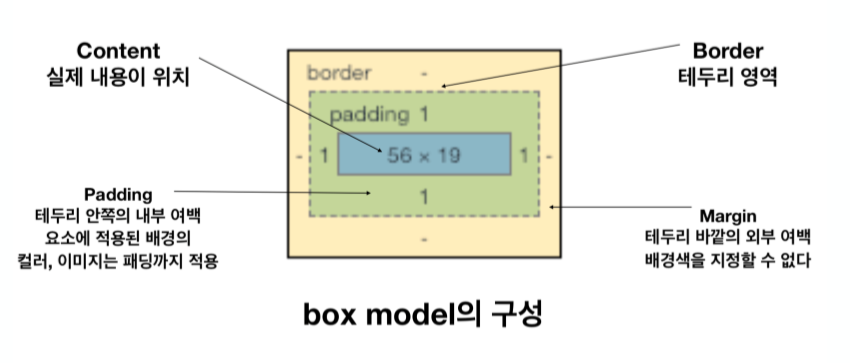

# CSS(Cascading Style Sheet)

cascading  : 폭포수 처럼 흘러내린다. 

css 는 styling의 정의

보여지는 것을 만드는 것. `HTML` 과는 다른 별개의 언어

### 1. [01_css.html](./01_css.html)

#### CSS 활용하기

1. Inline(인라인) -- 재사용 불가
2. Embedding(내부 참조) -- 다른 html에서 재사용 불가
3. link file(파일 첨부)


#### 선택자 우선 순위

* id > class > tag

* id는 문서에서 한번만 등장

* ```css
  .brown{
      color: brown !important
  }
  ```

* `!important`가 CSS 적용 가장 우선순위이다.


> #### CSS 단위
>
> 1. 키워드
> 2. 크기 단위
> 3. 색깔
>
> #### 프로퍼티 
>
> ​     P     { font-size : 12px;    color; red}
>
> 선택자  프로퍼티    값       프로퍼티 값


### 2. [02_selector.html](./02_selector.html)

```css
/* 인접 선택자 */  /*  .blue 클래스 .red 클래스 다음 div 에 적용 */
.blue + .red + div{
  background-color: purple
}

/* 자식 선택자 */ /* parent 하위 li태그에만 적용 직접적인 자식에게만 적용 */
.parent > li{
  color: red;
}

/* 후손 선택자 */ /* ancestor 하위 모든 li 태그에 적용 (자식의 자식...)까지 */
.ancestor li{
  color: blue;
}
```


### 3. [03_unit.html](./03_unit.html)

> `em` : 배수 단위로 상대 단위이다. 요소에 지정된 상속된 사이즈나 기본 사이즈에 대해 상대적인 사이즈 를 설정한다. 
>
> `rem`:  HTML 최상위 요소의 사이즈를 기준으로 삼는 크기 단위, r은 root를 의미한다.
>
>  
>
> `Viewport` : 디바이스마다 다른 크기의 화면을 가지고 있기 때문에 상대적인 단위인 viewport를 기준으로 만든 단위

| 단위 |               비고                |
| :--: | :-------------------------------: |
|  vw  |           너비의 1/100            |
|  vh  |           높이의 1/100            |
| vmin | 너비 또는 높이 중 작은 쪽의 1/100 |
| vmax |  너비 또는 높이 중 큰 쪽의 1/100  |

* 창을 줄일떄마다 크기가 바뀌는 것을 확인 할 수 있다.
* `html` 은 `16px`을 (브라우저 기본) ex)2rem --> 32px(16 * 2)
* `em`은 상위 요소의 배수

---

#### 색상 표현 단위

| 단위 |        비고        |
| :--: | :----------------: |
| HEX  |      #ffffff       |
| RGB  |    rgb(0, 0, 0)    |
| RGBA | rgba(0, 0, 0, 0.5) |

* RGBA 의 A는 alpha 값이다

---


### 4. [04_box_model.html](./04_box_model.html)

 

* margin
* padding
* border


* margin-shorthand( margin 사용법)

```css
.margin-shorthand-1{
  /* 상하좌우 */
  margin: 10px;
}

.margin-shorthand-2{
  /* 상하 / 좌우*/
  margin: 10px 20px;
}

.margin-shorthand-3{
  /* 상 / 좌우 / 하 */
  margin: 10px 20px 30px;
}

.margin-shorthand-4{
  /* 상 / 우 /하 /좌 - 시계방향 */
  margin: 10px 20px 30px 40px;
}
```


### 5. [05_display.html](05_dispaly.html)

#### display 속성

* `block` : 항상 새로운 라인에서 시작한다. 화면 크기 전체의 가로폭을 차지한다.(width: 100%)

  block 레벨 요소 내에 inline 레벨 요소를 포함할 수 있다.

* block 레벨 요소 예 `div`, `h1~h6`, `p`, `ol`, `ul`, `li`, `hr`, `table`, `form` 


* `inline` : 새로운 라인에서 시작하지 않으며 문장의 중간에 들어갈 수 있다. content의 너비만큼 가로폭을 차지한다. width, height, margin-top, margin-bottom 프로퍼티를 지정할 수 없다.

  상, 하 여백은 `line-height`로 지정한다.

* inline 레벨 요소 예 `span`, `a`, `strong`, `img`, `br`, `input`, `select`, `textarea`, `button`


### 6. [06_display_2.html](06_display_2.html)


- `inline-block` : block과 inline 레벨 요소의 특징을 모두 갖는다.

  inline 레벨 요소처럼 한 줄에 표시 되면서 block 에서의 width, height, margin(top, bottom) 속성을 모두 지정할 수 있다.

  

* `display: None`  : 해당 요소를 화면에 표시하지 않는다. (공간조차 사라진다.)
* `visibility: visible` : 해당 요소를 보이게 한다.(기본값)
* `visibility: hidden` : 해당 요소를 안 보이게 한다.(공간은 있음)


### 7. [07_position.html](07_position.html)


1. `static(기본위치)`

2. `relative(상대 위치)` :  기본 위치(static으로 지정 되었을 때의 위치)를 기준으로 좌표 프로퍼티

    (top, bottom, left, right)를 사용하여 위치를 이동(음수도 가능)

3. `absolute(절대 위치)` :  부모 요소 또는 가장 가까이 있는 조상 요소(static 제외)를 기준으로 좌표 프로퍼티(top, bottom, left, right)만큼 이동한다. 즉, `relative`, `absolute`, `fixed` 프로퍼티가 선언되어 있는 부모 또는 조상 요소를 기준으로 위치가 결정된다

4. `fixed( 고정 위치)` :  부모 요소와 관계없이 브라우저의 viewport를 기준으로 좌표 프로퍼티

   (top, bottom, left, right)을 사용하여 위치를 이동시킨다. 스크롤이 되더라도 화면에서 사라지지 않고 항상 같은 곳에 위치한다.


### 8. [08_float.html](08_float.html)


* `float` : 구름처럼 떠있음
* `float: left` 왼쪽에 추가
* `clear` : float 값을 취소 한다.


### 9. [09_background.html](09_background.html)

- block 요소는 높이를 지정하지않으면 높이가 없다.
- `background-size: cover`  또는 cover 대신 `px px`로 지정할 수 있다.
- `px px`로 하면 남은영역은 바둑판형식으로 채워진다.
- `background-repeat: no-repeat` 반복형식이 제거된다.


### 10. [10_font.html](10_font.html)

- `font-family`를 사용하여 글시체를 지정할 수 있다. 1번째 폰트가 없으면 , 2번째 ...
- `font-weight`를 사용하여 두깨를 조정할 수 있다.
- `font-style`을 사용하여  설정할 수 있다.
- `google web font` : link를 가져와서 font-family 설정을 한다.