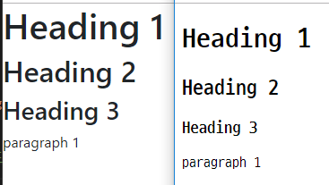

# Boot Strap

> `materialize` ,`Semantic UI`  도 반응형 웹


* BootStrap 적용/ 비적용





#### CDN?

> Content Delivery Network : 컨텐츠 를 효율적으로 전달하기 위해 여러 노드에 가진 네트워크에 데이터를 제공하는 시스템.

보여지는 것을 만드는 것. `HTML` 과는 다른 별개의 언어

### 1. [02_spacing.html](./02_spacing.html)

Where *property* is one of:

- `m` - for classes that set `margin`
- `p` - for classes that set `padding`

Where *sides* is one of:

- `t` - for classes that set `margin-top` or `padding-top`
- `b` - for classes that set `margin-bottom` or `padding-bottom`
- `l` - for classes that set `margin-left` or `padding-left`
- `r` - for classes that set `margin-right` or `padding-right`
- `x` - for classes that set both `*-left` and `*-right`
- `y` - for classes that set both `*-top` and `*-bottom`
- blank - for classes that set a `margin` or `padding` on all 4 sides of the element

Where *size* is one of:

- `0` - for classes that eliminate the `margin` or `padding` by setting it to `0`
- `1` - (by default) for classes that set the `margin` or `padding` to `$spacer * .25`
- `2` - (by default) for classes that set the `margin` or `padding` to `$spacer * .5`
- `3` - (by default) for classes that set the `margin` or `padding` to `$spacer`
- `4` - (by default) for classes that set the `margin` or `padding` to `$spacer * 1.5`
- `5` - (by default) for classes that set the `margin` or `padding` to `$spacer * 3`
- `auto` - for classes that set the `margin` to auto                     

### 2. [03_color_spacing.html](./03_color.html)

                    

### 3. [04_border.html](./04_border.html)

[bootstrap border](https://getbootstrap.com/docs/4.3/utilities/borders/)

```css
<span class="border-0"></span>
<span class="border-top-0"></span>
<span class="border-right-0"></span>
<span class="border-bottom-0"></span>
<span class="border-left-0"></span>
```

```css


```


### 4. [05_display.html](./05_display.html)

- `.d-{value}` for `xs`
- `.d-{breakpoint}-{value}` for `sm`, `md`, `lg`, and `xl`.

Where *value* is one of:

- `none`
- `inline`
- `inline-block`
- `block`
- `table`
- `table-cell`
- `table-row`
- `flex`
- `inline-flex`

### 5. [06_position.html](./06_position.html)

```css
<div class="position-static">...</div>
<div class="position-relative">...</div>
<div class="position-absolute">...</div>
<div class="position-fixed">...</div>
<div class="position-sticky">...</div>
```


### 7. [07_components.html](./07_components.html)

[Components](https://getbootstrap.com/docs/4.3/components/alerts/)